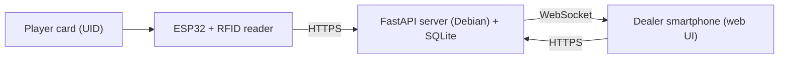

# OpenCroupier

> A self-hosted RFID banking system for casino nights.

> [!NOTE]
> **Project status: planning / early design.** No code has been written yet.
> This document describes the target architecture.

## Overview

OpenCroupier replaces chips and cash at a casino night with a central digital bank.
A Debian server keeps track of every player's balance. Each player is identified by
the UID of their student RFID card. Tables are equipped with ESP32 terminals fitted
with an RFID reader, and dealers (croupiers) manage bets and winnings from their
own smartphone.

## Architecture

| Component | Language | Stack | Role |
|---|---|---|---|
| Server & API | Go | Chi (or Gin), modernc.org/sqlite, gorilla/websocket | Accounts, balances, transaction history, sessions, real-time push |
| RFID terminals | C / C++ | Arduino framework, ESP32, MFRC522 (SPI) | Read cards, talk to the server over HTTPS, drive status LEDs |
| Dealer interface | JavaScript | Web app (framework not decided yet) | Show the balance of the scanned player, enter gains/losses |

### Typical flow

1. A player taps their card on a table terminal.
2. The ESP32 reads the UID and sends it to the server (`POST /api/scan`).
3. The server pushes the player's balance to the dealer's phone through WebSocket.
4. The dealer enters a bet or a gain (e.g. `-10`) and confirms.
5. The server updates the balance in SQLite and tells the terminal to show success (green LED).

### Dealer ↔ table pairing

Nothing secret is ever displayed on a terminal and card UIDs are never used in URLs
(a UID is static and easy to copy over NFC).

1. Before the event, dealer accounts are created on the server (username, password, card UID).
2. At the start of the night, each ESP32 (identified by a hardcoded ID such as `Table_01`) is locked and waits for a card.
3. The dealer logs in on their phone (secure session cookie) and waits for assignment.
4. The dealer taps their card on the terminal, which calls `POST /api/assign_table` with `{"table": "Table_01", "uid": "..."}`.
5. The server matches the UID to the logged-in dealer and pushes a WebSocket message that unlocks the dealer's UI for that table.
6. On logout, the terminal goes back to the locked state.

## Security design

- All terminal ↔ server traffic uses **HTTPS/TLS** (`WiFiClientSecure`), not a custom AES scheme.
- Dealer access relies on server-side sessions, not on secret URLs.
- Pairing requires **both** the dealer's web login and their physical card.
- The server must reject duplicate scans from the same card within a few seconds (RFID debouncing).

## Deployment notes

- SQLite is sufficient for a few hundred players and thousands of transactions.

## Roadmap

- [ ] Define the API contract (scan, assign table, transaction, balance)
- [ ] Server: FastAPI app, SQLite schema, authentication, WebSockets
- [ ] Terminal firmware: Wi-Fi, HTTPS, MFRC522, debouncing, status LEDs
- [ ] Dealer web interface
- [ ] Admin tooling: account creation, initial balances, transaction history
- [ ] Deployment guide (Debian, TLS certificate, Wi-Fi router)

## Use of AI

AI was used to help design the architecture of this project (technology choices,
component breakdown, pairing and security flow). **No line of code in this project
is, or will be, written by AI.** All source code is written by hand by the maintainer.

## Contributing

See [CONTRIBUTING.md](CONTRIBUTING.md).

## License

Licensed under the [Apache License, Version 2.0](LICENSE).

## Author

Maintained by **Chefmine** — <ChMi8@pm.me>
